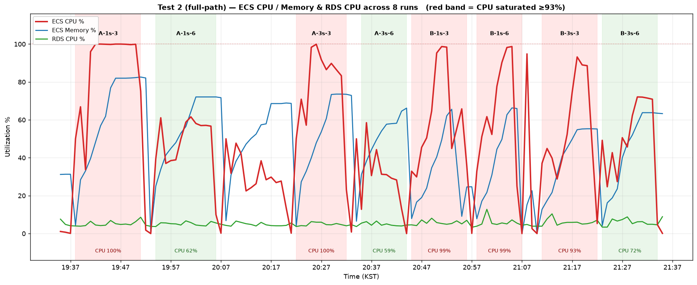

# 부하테스트 리포트 #5-2 — 풀 경로 결합 (테스트②)

**목적**: 개선 3종(BY-470 코얼레싱 버퍼 · BY-491 힙 상한·WS 송신버퍼 한도 · BY-587 ICE 팩토리) 적용 상태에서 **체크포인트 주기(1초/3초) × 방 인원(3명/6명) × 태스크 스펙(현행/최대)** 을 교차로 돌려, 단일 태스크의 수용 한계(무릎점)와 p95/p99 응답시간을 실측한다.

**대상**: ECS Fargate ARM64 · **A = 0.5 vCPU / 1 GiB (현행 prod)**, **B = 1 vCPU / 2 GiB (최대)** · RDS db.t4g.micro · coturn Oracle A1(릴레이 미주입)

**공통**: SIGNAL=1(WebRTC mesh, 세션당 3회) · 상태 브로드캐스트 10초 · 로드젠→ALB 왕복 +50ms(netem) · HOLD=900(세션 안 나감) · 로드젠 c7g.2xlarge(k6 v2.2.0)

**프로파일**: A = 500→1000→1500→2000, B = 1000→2000→3000→4000→5000 (각 단계 도달 후 유지, 최종 단계 3분). A-1/A-2는 최종 5분, A-3 이후는 3분 유지(도달 후 지표는 1~2분에 안정되어 결론 동일).

**8런 구성**: A-{1s,3s}-{3,6} / B-{1s,3s}-{3,6}

---

## 1. 결과 요약

### 1-1. 한 줄 결론

- **현행 스펙(0.5vCPU/1GiB)** 은 체크포인트 3초·방6명이면 **2000명을 전 SLO 통과**로 버틴다. 체크포인트 1초는 방3명에서 2000명 도달 중 붕괴, 방6명이면 2000명을 견딘다.
- **최대 스펙(1vCPU/2GiB)** 은 체크포인트 3초면 **5000명까지 체크포인트 응답 완벽**(p99 59ms), 방6명이면 입장 지연까지 포함해 **5000명 전 SLO 통과**. 체크포인트 1초는 방3명 ~3000명 / 방6명 ~4000명에서 무릎점.
- 지배 요인은 **지표에 따라 다르다**: **수용 인원(무릎점)** 은 체크포인트 빈도 ≳ 방 인원 > 스펙 순으로, **입장 응답 속도**는 방 인원(=방 수)이 지배한다. 셋 다 CPU 부하를 통해 작동하며(방 수는 팬아웃 CPU를, 체크포인트는 write CPU를 태운다), **DB·메모리는 전 구간 병목이 아니다**.

### 1-2. 8런 종합 (★ = 전 SLO 통과)

| 런 | 스펙 | cp | 방 | 최대 안정 인원 | **CPU peak** | checkpoint p99 | 입장 p95 | WS성공 | 판정 |
|---|---|---|---|---|---|---|---|---|---|
| A-1s-3 | 0.5/1 | 1s | 3명 | ~1500 | **100%** | 2.69s | 47s | 40% | 🔴 2000 도달 중 붕괴 |
| A-1s-6 | 0.5/1 | 1s | 6명 | **2000** | 62% | 70ms | 590ms | 100% | ✅ 완주(입장 OK) |
| A-3s-3 | 0.5/1 | 3s | 3명 | 2000 | **100%** | 309ms | 7.5s | 100% | 🟡 완주·입장 SLO 초과 |
| A-3s-6 | 0.5/1 | 3s | 6명 | **2000** | 59% | 75ms | 566ms | 100% | ★ 완주(전 SLO) |
| B-1s-3 | 1/2 | 1s | 3명 | ~3000 | 99% | 1.41s | 13.7s | 36% | 🔴 무릎점 ~3000~3500 |
| B-1s-6 | 1/2 | 1s | 6명 | ~4000 | 99% | 1.61s | 27.7s | 37% | 🔴 무릎점 ~4000~5000 |
| B-3s-3 | 1/2 | 3s | 3명 | 5000 | 93% | 59ms | 1.5s(p99 3.98s) | 100% | 🟡 5000 완주·입장 SLO 초과 |
| B-3s-6 | 1/2 | 3s | 6명 | **5000** | **72%** | 58ms | 636ms(p99 824ms) | 100% | ★ 5000 완주(전 SLO) |

> SLO: checkpoint p99 < 500ms · 입장(subscribe→snapshot) p99 < 1000ms · WS 연결성공 > 99% · http 실패 < 1%. join 실패는 A-1s-3 22,100건·B-1s-3 570,664건·B-1s-6 565,871건(붕괴 시 재입장 폭주), 나머지 런은 0.

> ECS CPU(빨강)·Memory(파랑)·RDS CPU(초록)의 8런 타임라인. **붉은 배경 = CPU 포화(≥93%)**, 초록 배경 = CPU 여유. **RDS는 전 구간 5% 안팎 바닥**이고, 봉우리는 전부 ECS CPU다. 전 SLO를 통과한 두 런(A-3s-6 59%, B-3s-6 72%)만 CPU에 여유가 있다 — 나머지는 완주해도 CPU가 포화라 입장 지연이 SLO를 넘긴다.

---

## 2-1. 인원별 상세 (actuator 10초 스냅샷 요약)

| 런 | 1000명 heap | 최종 heap / committed | Hikari pending(최대) | WS 최대 | 거동 |
|---|---|---|---|---|---|
| A-1s-3 | 356MB | 456 / **672**MB | **185** | 1,916 | 2000 도달 시 WS 붕괴 → 재입장 폭주 |
| A-1s-6 | 179MB | 395 / 675MB | 0 | 2,000 | 평탄 |
| A-3s-3 | 174MB | 399 / 676MB | 0 | 2,000 | 평탄(입장 지연만) |
| A-3s-6 | 131MB | ~330 / 675MB | 0 | 2,000 | 평탄 |
| B-1s-3 | 160MB | 740 / **1172**MB | 0 | 4,909 | 4000 램프에서 transportError 급증 |
| B-1s-6 | 152MB | 922 / 1171MB | 0 | 4,000 | 5000 램프에서 붕괴 |
| B-3s-3 | 163MB | 784 / 989MB | 0 | 5,000 | 평탄(입장 지연만) |
| B-3s-6 | 152MB | ~700 / 989MB | 0 | 5,000 | 평탄 |

핵심 관찰:
- **committed 메모리가 스펙 상한 근처에서 평평하게 멈춘다**(A 675MB / 1GiB, B 1172MB / 2GiB). 리포트 #2에서 cp1초가 1000명 유지 중 committed가 계속 올라 OOM(exit 137) 나던 현상이 **BY-491 힙 상한으로 사라졌다** — 이번 8런 중 OOM 사망은 0건.
- **Hikari pending은 A-1s-3에서만 185까지 치솟고 나머지는 0**. A-1s-3의 pending은 DB 과부하가 아니라 **CPU 100% 포화로 앱 스레드가 커넥션을 오래 쥔** 앱 측 대기줄이다(RDS CPU는 아래 참고). 체크포인트를 3초로 낮추거나(A-3s-3) 방을 6명으로 키우면(A-1s-6) pending이 0으로 사라진다.
- A-1s-3의 붕괴가 **3명방 자체 문제가 아님을 A-3s-3가 증명**한다: 같은 3명방·같은 스펙에서 체크포인트만 3초로 낮추자 join 실패 22,100 → 0, WS 40% → 100%로 완전히 회복했다. A-1s-3의 붕괴는 **"방3명(방 수 2배) + 체크포인트 1초"가 겹쳐 CPU를 포화**시킨 결과다.
- 다만 **A-3s-3도 CPU는 100% 포화**였다(완주했을 뿐 입장 7.5s). 방 수 2배(667개)의 팬아웃만으로도 0.5vCPU는 포화한다 — 체크포인트를 3초로 낮춘 덕에 join 폭주가 없어 완주했을 뿐, CPU 여유는 없다. 방6명(A-3s-6)이라야 CPU가 59%로 떨어지며 입장까지 566ms로 통과한다.

## 2-2. 응답시간 p95 / p99

| 런 | checkpoint p95 / p99 | 입장 subscribe→snapshot p95 / p99 |
|---|---|---|
| A-1s-3 | 1.11s / 2.69s | 46.9s / 51.2s |
| A-1s-6 | 53ms / 70ms | 590ms / 616ms |
| A-3s-3 | 109ms / 309ms | 7.5s / 7.8s |
| A-3s-6 | 53ms / 75ms | 566ms / 605ms |
| B-1s-3 | 1.13s / 1.41s | 13.7s / 92.7s |
| B-1s-6 | 1.23s / 1.61s | 27.7s / 77.0s |
| B-3s-3 | 53ms / 59ms | 1.48s / 3.98s |
| B-3s-6 | 53ms / **58ms** | 636ms / **824ms** |

→ **입장 지연이 체크포인트보다 먼저 SLO를 깬다.** B-3s-3는 체크포인트 p99가 59ms로 완벽한데 입장 p99만 3.98s로 SLO를 넘긴다. 입장 응답은 방 브로드캐스트·스냅샷 팬아웃 경로라, CPU가 포화에 가까워지면 체크포인트(단순 DB write)보다 먼저 밀린다. **방6명(B-3s-6)은 방 수가 절반이라 이 팬아웃 부담이 작아 입장 p99까지 824ms로 통과**한다.

---

## 3. 병목 정리

| 병목 | 관측 | 판정 |
|---|---|---|
| **DB(RDS)** | 전 8런 RDS CPU 4~9%, DatabaseConnections 10 고정 | ✅ 병목 아님. 풀 확대·RDS 업그레이드는 근본책 아님 |
| **DB 커넥션풀** | A-1s-3만 pending 185, 나머지 0 | 🟡 CPU 포화의 그림자. 체크포인트↓ 또는 방인원↑로 소멸 |
| **메모리(OOM)** | committed가 스펙 상한 근처에서 평탄, OOM 0건 | ✅ BY-491 힙 상한으로 해결(리포트 #2 대비) |
| **앱 CPU** | peak: A-1s-3 100%·A-1s-6 62%·A-3s-3 100%·A-3s-6 59%·B-1s-3 99%·B-1s-6 99%·B-3s-3 93%·B-3s-6 72%. 전 SLO 통과한 A-3s-6·B-3s-6만 CPU 여유 | 🔴 **유일한 실질 병목.** 체크포인트 빈도·방 수·스펙이 모두 CPU를 통해 작동 |

**지표에 따라 지배 요인이 다르다** — 처리량(무릎점)과 지연(입장 응답)은 다른 변수가 지배한다:

**입장 지연(latency) — 방 수가 지배** (같은 조건에서 방만 3↔6):

| 고정 | 방3명 입장 | 방6명 입장 | 방6명 이득 |
|---|---|---|---|
| 0.5vCPU·cp3 | 7.5s | 566ms | ~13배 |
| 1vCPU·cp3 | p99 3.98s | p99 824ms | ~5배 |

방 수가 2배(667 vs 334)면 상태 브로드캐스트·스냅샷 팬아웃이 2배라 CPU가 포화(A-3s-3는 방3명이라 CPU 100%인데도 완주는 하되 입장 7.5s). **A-1s-6(cp1·방6명) 590ms가 A-3s-3(cp3·방3명) 7.5s보다 빠른 건 이 때문** — 체크포인트를 3초로 낮춘 이득보다 방 수 2배 손해가 더 컸다.

**처리량(무릎점) — 체크포인트가 약간 더 지배** (같은 조건에서 cp만 1↔3):

| 고정 | cp1 무릎 | cp3 무릎 | cp3 이득 |
|---|---|---|---|
| 1vCPU·방3명 | ~3000 | 5000+ | +2000 |
| 1vCPU·방6명 | ~4000 | 5000+ | +1000 |

체크포인트 1초의 초당 write가 CPU를 직접 태워, 3초로 낮추면 무릎점이 크게 오른다(방3명 +2000). 같은 축에서 방 인원은 +1000(1vCPU·cp1에서 방3명 3000→방6명 4000).

**스펙 0.5→1 vCPU**: 무릎점을 약 2배로 민다(A-1s-3 ~1500 → B-1s-3 ~3000).

요약: **응답 속도가 목표면 방 수(방 인원)를, 수용 인원이 목표면 체크포인트 주기를 우선 조정**한다. 근본은 셋 다 CPU이며, 방 수는 팬아웃 CPU를·체크포인트는 write CPU를 태운다.

---

## 4. 결론

1. **현행 스펙(0.5vCPU/1GiB)으로 2000 동접은 안전하다 — 단, 체크포인트 3초·방6명 조합에서.** A-3s-6가 checkpoint p99 75ms·입장 p95 566ms로 전 SLO 통과. 체크포인트 1초는 방3명에서 2000 도달 중 붕괴하므로, **운영 기본값은 체크포인트 3초를 권장**한다.
2. **최대 스펙(1vCPU/2GiB)의 실측 수용량: 체크포인트 3초·방6명 5000명 완주(전 SLO 통과, 입장 p99 824ms).** 방3명(B-3s-3)도 체크포인트는 5000명까지 완벽하고 입장 지연만 SLO를 넘긴다. 체크포인트 1초는 방3명 ~3000 / 방6명 ~4000이 무릎점.
3. **개선 3종 효과 확인**: BY-491 힙 상한으로 리포트 #2의 OOM(exit 137)이 재발하지 않았다(8런 0건). committed 메모리가 스펙 상한에서 평탄하게 수렴한다.
4. **DB는 병목이 아니다**: 전 구간 RDS CPU 4~9%, 커넥션 10 고정. Hikari pending은 앱 CPU 포화의 결과이지 DB 과부하가 아니다.
5. **입장(subscribe→snapshot) 지연이 다음 개선 지점**: 체크포인트가 완벽한 구간에서도 입장 p99가 먼저 SLO를 넘는다. 방 브로드캐스트·스냅샷 팬아웃이 CPU 포화 시 밀리는 것으로, 방6명일수록(방 수 절반) 유리하다.

## 5. 알려진 한계

- **릴레이(TURN)는 미주입**: 미디어는 클라이언트↔coturn 직결이라 Spring/ALB와 자원을 공유하지 않는다. coturn 한계는 리포트 #5-1(테스트①)에서 독립 실측했다. 본 리포트는 Spring 풀 경로(입장 자격 발급·시그널링·체크포인트)만 측정한다.
- **SIGNAL=1(worst-case)**: 시그널을 세션당 3회로 저빈도 재현했으나, 실제 WebRTC는 입장 시 버스트 후 침묵이라 실부하 CPU는 더 낮을 수 있다.
