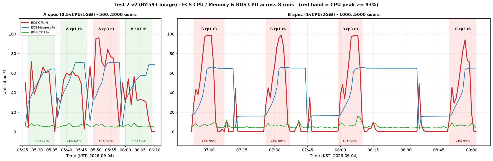

# 부하테스트 리포트 #5-4 — 풀 경로 결합 재실행 (BY-593 적용, 테스트② v2)

**목적**: #5-2에서 확인한 "방 개수에 비례하는 CPU 오버헤드"(`cleanupExpired`의 5초 전체 방 순회 × 전역 락)를 **BY-593(만료 후보 인덱스)** 으로 제거한 뒤, 같은 8런을 다시 돌려 **전/후 효과**를 실측한다.
**대상**: ECS Fargate ARM64 · **A = 0.5 vCPU / 1 GiB (현행 prod)**, **B = 1 vCPU / 2 GiB** · RDS db.t4g.micro · coturn Oracle A1(릴레이 미주입)
**이미지**: BY-491 브랜치 + BY-593(cleanupExpired 인덱스, TurnCredentialIssuer 분리). #5-2와의 차이는 BY-593 유무뿐(BY-587은 두 쪽 다 비활성).
**공통**: #5-2와 동일 — SIGNAL=1(세션당 3회) · 브로드캐스트 10초 · netem +50ms · HOLD=900 · **단축 프로파일**(중간 45초·최종 3분) 8런 전부 동일 · 매 런 전 태스크 강제 교체.
**프로파일**: A = 500→1000→1500→2000, B = 1000→2000→3000→4000→5000.

> #5-2 비교값 주의: #5-2의 A-1s-3·A-1s-6은 긴 프로파일(최종 5분 유지)이었다. 도달 시점 지표 비교라 결론에 영향 없음.

---

## 1. 결과 요약 — **A스펙(현행 prod)은 4런 중 3런 전 SLO 통과, 3명방 붕괴 조건이 완전히 해소. B스펙은 cp1 무릎이 +1000명씩 상향, 5000명 입장 버스트는 여전히 CPU 한계**

### 1-1. 8런 전/후 비교 (★ = 전 SLO 통과)

| 런 | 스펙 | cp | 방 | #5-2 (BY-491) | **v2 (BY-593)** | CPU peak 전→후 | checkpoint p99 전→후 | 입장 p95 전→후 |
|---|---|---|---|---|---|---|---|---|
| A cp1·3명 | 0.5/1 | 1s | 3명 | 🔴 붕괴(join 실패 22,100·WS 40%) | **★ 전 SLO** | **100% → 66%** | 2.69s → **80ms** | 47s → **607ms** |
| A cp1·6명 | 0.5/1 | 1s | 6명 | ✅ | ★ | 62% → 62% | 70 → 86ms | 590 → 602ms |
| A cp3·3명 | 0.5/1 | 3s | 3명 | 🟡 입장 SLO 초과 | 🟡 입장 SLO 초과 | 100% → 96%(램프)/66~84%(유지) | 309 → **117ms** | 7.5s → 5.1s |
| A cp3·6명 | 0.5/1 | 3s | 6명 | ★ | ★ | 59% → **56%**(유지 32%) | 75 → 79ms | 566 → 591ms |
| B cp1·3명 | 1/2 | 1s | 3명 | 🔴 무릎 ~3000 | 🟡 **무릎 ~4000**, 5000 부분 열화 | 99% → 99% | 1.41s → 1.32s | 13.7s → 30s(램프) |
| B cp1·6명 | 1/2 | 1s | 6명 | 🔴 무릎 ~4000(5000 램프 붕괴) | 🟡 **5000 완주**(WS 100%·join 실패 0), 입장만 초과 | 99% → 99%(유지 55~88%) | 1.61s → **465ms** | 27.7s → 33s(램프) |
| B cp3·3명 | 1/2 | 3s | 3명 | 🟡 5000 완주(입장 초과) | 🔴 **무릎 ~4000**, 5000 유지 중 이탈 | 93% → 99% | 59 → 327ms | 1.5s → 8.4s |
| B cp3·6명 | 1/2 | 3s | 6명 | ★ 5000 전 SLO | 🟡 5000 완주(WS 100%·join 0), 입장만 초과 | 72% → 94%(유지 71~73%) | 58 → 67ms | 636ms → 13.8s(램프) |

> SLO: checkpoint p99 < 500ms · 입장(subscribe→snapshot) p99 < 1000ms · WS 연결성공 > 99% · http 실패 < 1%. 입장 지연에는 k6의 500ms 고정 대기가 하한으로 깔린다(실제 프론트는 즉시 요청+재시도라 정상 시 더 빠름 — #5-2 §5 참고).

> 왼쪽 A스펙(4런), 오른쪽 B스펙(4런). 붉은 배경 = CPU peak ≥93%. RDS(초록)는 전 구간 바닥. **A스펙에서 붉은 구간이 cp3·3명방 램프 하나로 줄었고**(#5-2는 3명방 2런 모두 100% 붙박이), B스펙은 5000 입장 버스트 순간은 여전히 붉지만 유지 구간은 55~88%로 내려온다.

### 1-3. 유지 구간 기준 재정리 (램프·콜드 스타트 제외)

1-2 표의 k6 p95/p99는 **런 전체** 집계라 램프 초반(교체 직후 JIT 콜드 JVM + 입장 버스트)이 섞여 있다. 아래는 **최종 인원(A 2,000 / B 5,000)에 95% 도달한 시점부터 유지 구간(180s, #5-2 A cp1 런은 300s)만** 잘라 다시 계산한 값이다 — CPU는 그 구간 분 단위 중앙값/최대, WS 이탈은 10초 스냅샷의 최소 세션 수 기준, checkpoint p99는 k6 전체 집계(대부분의 샘플이 유지 구간이라 근사).

| 런 | 도달 | CPU 중앙/최대 (전) | CPU 중앙/최대 (**후**) | 유지 중 WS 이탈 (전 → 후) | checkpoint p99 (전 → 후) | Hikari pending 전→후 |
|---|---|---|---|---|---|---|
| A cp1·3명 | 2,000 | **100 / 100** | **62 / 66** | **38%** → **0%** | 2.69s → **80ms** | 176 → 0 |
| A cp1·6명 | 2,000 | 57 / 62 | 57 / 58 | 0% → 0% | 70 → 86ms | 0 → 0 |
| A cp3·3명 | 2,000 | 86 / 90 | **76 / 77** | 0% → 0% | 309 → **117ms** | 0 → 0 |
| A cp3·6명 | 2,000 | 29 / 31 | 32 / 33 | 0% → 0% | 75 → 79ms | 0 → 0 |
| B cp1·3명 | 5,000 | (붕괴) 55 / 66 | **99 / 99** | **100%**(전원 이탈) → **2.9%** | 1.41s → 1.32s | 0 → 0 |
| B cp1·6명 | 5,000 | **미도달**(4,000에서 붕괴, 58% 이탈) | 93 / 99 | — → **4.6%** | 1.61s → **465ms** | 0 → 0 |
| B cp3·3명 | 5,000 | 89 / 93 | **99 / 99** | 3.1% → **18.4%** | 59 → 327ms | 0 → 0 |
| B cp3·6명 | 5,000 | 72 / 72 | 73 / 94 | 5.0% → **0%** | 58 → 67ms | 0 → 0 |

같은 유지 구간의 ALB 측 지표(HTTP 경로 = join·checkpoint, 분 단위 p99 최대 / 4xx 합계):

| 런 | ALB p99 (전 → 후) | 4xx (전 → 후) |
|---|---|---|
| A cp1·3명 | **3.59s → 0.01s** | **6,486 → 0** |
| A cp1·6명 | 0.02 → 0.00s | 0 → 0 |
| A cp3·3명 | 0.07 → 0.02s | 0 → 0 |
| A cp3·6명 | 0.02 → 0.00s | 0 → 0 |
| B cp1·3명 | 1.45 → **0.54s** | 341 → **0** |
| B cp1·6명 | 1.69 → **0.33s** | 1,532 → **0** |
| B cp3·3명 | 0.01 → 0.22s | 0 → **12,137** |
| B cp3·6명 | 0.01 → 0.02s | 0 → 0 |

> 4xx는 전부 재입장 409(정원)이며 5xx는 16런 모두 0. B cp3·3명 v2의 4xx 12,137은 유지 중 이탈(18.4%)의 재입장 폭주 — 위 표의 후퇴와 같은 사건이다.

유지 구간으로 보면 그림이 더 또렷하다:
- **A스펙 4런 전부 유지 구간 WS 이탈 0%, CPU 33~77%.** 1-2 표에서 A cp3·3명이 "입장 SLO 초과"로 보였던 건 램프 초반 2분(CPU 96%)의 값이고, **유지 구간 CPU는 86→76%로 오히려 개선**됐다. cp1과 cp3의 순서가 라운드마다 뒤집히는 건 경계 근처 단일 런 편차이며, cp3가 체계적으로 불리한 근거는 없다.
- **B cp1 두 런은 명확히 개선**: 3명방은 전원 이탈 → 2.9%, 6명방은 4,000에서 붕괴 → 5,000 도달·4.6% 이탈. 다만 CPU 99%라 **B의 안전선은 4,000**이 맞다.
- **B cp3·3명은 후퇴**(이탈 3.1% → 18.4%, CPU 89 → 99%). 두 라운드 모두 CPU 90%대 경계였고, 이번엔 넘어갔다. 단일 런이라 편차와 실제 후퇴를 가를 수 없어 **재측정 필요**로 남긴다.
- **B cp3·6명은 5,000 유지 구간 이탈 0%, CPU 73%** — B스펙에서 가장 안정적인 운영 조합.

> 방법론 개선(다음 라운드): 태스크 교체 후 **워밍업 60초(저부하)** 를 두어 JIT 콜드를 측정에서 빼고, 경계 조건은 **2~3회 반복**해 중앙값을 쓴다. 램프 구간과 유지 구간 지표를 표에서 분리 표기한다.

### 1-4. 왜 A cp3·3명방이 cp1·3명방보다 나빠 보였나 — 부하 차이가 아니라 태스크 편차

체크포인트 3초는 1초보다 API 요청이 1/3이므로 **부하는 확실히 덜하다**. 요청 단위로도 그랬다(cp3·3명 checkpoint p99 117ms, 유지 구간 ALB p99 0.02s — 정상). 그런데 v2에서 cp3·3명만 **입장 p95 5.1s**로 SLO를 넘겼다. 이유는 셋으로 나뉜다.

**① 입장 지연은 "CPU가 한 번이라도 붙박이였나"에 극단적으로 민감하다.** 입장(subscribe→snapshot)은 STOMP 인바운드 큐 → RoomService 전역 락 → 스냅샷 조립 → 브로커 송신 경로다. CPU가 포화되면 인바운드 큐에 스냅샷 요청이 줄을 서서 수 초씩 밀린다. cp3·3명 런은 **램프 초반 2분(500→1000명 입장 버스트)에 CPU 95~96%** 를 찍었고, 그때 들어온 입장이 5초짜리로 기록됐다. 유지 구간에 들어간 뒤로는 입장도 정상(ALB p99 0.02s).

**② 그 런의 태스크가 전 구간에서 ~20% 느렸다 — 부하 차이로 설명되지 않는 역전.**

| v2 A·3명방 | 램프 초반 CPU | 유지 구간 CPU | 유지 구간 ALB p99 |
|---|---|---|---|
| cp 1초 | 72% | **62%** | 0.01s |
| cp 3초 | 96% | **76%** | 0.02s |

체크포인트를 1/3로 줄였는데 유지 구간 CPU가 14pt **더 높다**. 요청량으로는 불가능한 방향이므로, 이 런의 **태스크 자체가 느렸다**고 보는 것이 맞다. 매 런 태스크를 강제 교체했으니 런마다 다른 Fargate 호스트(Graviton 세대·이웃 부하)를 뽑은 셈이고, CPU%는 할당 vCPU 대비 값이라 느린 호스트에서는 같은 일이 더 높은 %로 찍힌다. 여기에 JIT 워밍업이 입장 버스트와 정면으로 겹친 정도의 차이가 더해진다.

**③ 직전 라운드(#5-2)에서는 반대로 뒤집혔다** — cp1·3명 붕괴(CPU 100%), cp3·3명 완주(86%). 체크포인트 주기의 효과라면 방향이 일정해야 한다. 라운드마다 뒤집힌다는 것은 **런 간 편차가 두 조건의 차이보다 크다**는 뜻이다. A스펙 3명방은 유지 CPU 60~90% 경계에 있어, 태스크 속도 ±20%가 "전 SLO 통과"와 "입장 SLO 초과"를 가른다.

**결론**: "cp3가 입장에 불리하다"는 결론은 성립하지 않으며, 이 두 런으로는 "cp3 런의 태스크가 느렸다"도 확정할 수 없다(태스크 하드웨어를 기록하지 않았다). 확정 절차는 다음 라운드에: (1) 태스크 시작 시 `/proc/cpuinfo`·`lscpu`로 하드웨어 세대 기록 (2) 같은 구성 2~3회 반복 (3) 워밍업 60초 뒤부터 측정. 운영 권장값(체크포인트 3초)은 이 편차와 무관하게 유효하다 — 요청량이 1/3이라는 사실은 변하지 않는다.

---

## 2-1. BY-593 효과가 드러난 곳 — 방 수 오버헤드 제거

| 지표 (A cp1·3명, 방 667개) | #5-2 | v2 | 의미 |
|---|---|---|---|
| CPU (2000명 유지) | 100% 붙박이 | **60~66%** | 5초 전체 순회 + 전역 락 점유가 사라짐 |
| Hikari pending 최대 | 185 | **0** | CPU 포화의 그림자였던 대기줄 소멸 |
| WS 연결 성공 / join 실패 | 40% / 22,100 | **100% / 0** | 붕괴 → 재입장 폭주 사이클 자체가 발생 안 함 |
| committed 메모리 | 672MB | **526MB** | 순회용 `List.copyOf` 복사 할당 감소 |

- **3명방(방 수 2배)에서만 효과가 집중**되고 6명방은 전후 동일 — 이 오버헤드가 "방 개수 비례"였다는 #5-2 §3의 진단을 실측으로 확정.
- A cp3·3명방은 유지 구간 CPU가 100% → 66~84%로 내려갔지만 램프 초반 2분(500→1000명 입장 버스트 + 교체 직후 JIT 콜드)에 96%를 찍어 입장 p95가 5.1초로 남았다. 정상 상태(ALB p99 0.1s)는 문제없다.

## 2-2. 효과가 제한적인 곳 — B스펙 5000명 입장 버스트

B스펙에서 5000명 도달 순간(4000→5000 램프 25초 + 입장 버스트)의 CPU는 v2에서도 94~99%다. 이건 방 순회가 아니라 **초당 수백 건의 join + STOMP CONNECT + 스냅샷 팬아웃**이 겹치는 순수 처리량 한계라 BY-593 범위 밖이다. 유지 구간으로 들어가면 CPU가 55~88%로 내려앉는다(B cp1·6명: 99% → 55%).

- **cp1 런은 개선**: 3명방 무릎 3000→4000, 6명방은 5000 램프 붕괴 → 5000 완주(WS 100%).
- **cp3·3명방은 후퇴**: #5-2에선 5000을 CPU 93%로 아슬아슬하게 완주했는데 v2에선 99%에서 유지 중 세션 이탈(4718→4080) → 재입장 409 폭주(분당 4만 건)로 무너졌다. 4000까지는 이탈 0. 경계(93~99%)에서의 런 간 편차로 해석하며, **"B·cp3·3명방 5000은 불안정"** 으로 판정한다.
- 이탈 후 409 폭주는 k6가 끊기자마자 재입장하는 특성이 증폭한 것이다(실제 클라이언트는 재시도 백오프 있음). 다만 서버가 유예(30초) 동안 자리를 잡고 있어 재입장이 409로 튕기는 구조는 실사용에서도 같으니 별도 개선 여지(끊김 유예 중 같은 유저 재입장 허용은 이미 구현되어 있음 — 409는 다른 VU가 같은 방으로 몰릴 때).

---

## 3. 병목 정리

| 병목 | v2 관측 | 판정 |
|---|---|---|
| **DB(RDS)** | 전 8런 RDS CPU 4~9%, 커넥션 10 | ✅ 병목 아님(불변) |
| **DB 커넥션풀** | pending 8런 전부 0 (#5-2는 A cp1·3명 185) | ✅ BY-593으로 소멸 |
| **메모리(OOM)** | committed 스펙 상한 근처 평탄, OOM 0건 | ✅ BY-491 유지 |
| **방 수 오버헤드(전체 순회 × 전역 락)** | A cp1·3명 CPU 100→66% | ✅ **BY-593으로 제거** |
| **앱 CPU — 입장 버스트** | B 5000 도달 시 94~99%, A cp3·3명 램프 96% | 🔴 남은 병목. 방 순회와 무관한 join/CONNECT/스냅샷 처리량 |

---

## 4. 결론

1. **현행 스펙(0.5vCPU/1GiB)에서 2000 동접은 이제 체크포인트 1초·3명방까지 전 SLO 통과** — #5-2에서 붕괴하던 조건이 해소됐다. 운영 기본값 "체크포인트 3초·6명방" 권장은 유지하되, 그 조건이 아니어도 2000명은 버틴다.
2. **BY-593의 효과는 "방 개수 비례 오버헤드 제거"로 정확히 한정**된다: 3명방(방 2배)에서 CPU 1/3 절감, 6명방은 불변. #5-2 §3의 원인 진단이 맞았다.
3. **B스펙 5000명은 유지는 되지만 입장 버스트가 CPU 한계**다. cp1 런 무릎이 +1000씩 올라갔고(3000→4000, 4000→5000 완주), cp3·6명방은 5000 완주(입장 지연만). cp3·3명방은 경계에서 후퇴(불안정). **B스펙 안전 동접은 4000**으로 잡고, 5000은 "입장을 분산시키면 가능"으로 본다.
4. **다음 병목은 입장 경로(join + STOMP CONNECT + 스냅샷 팬아웃)** 다. 후보: 전역 락을 방 단위로 쪼개기(#5-2 §3 후속), 입장 버스트 완화(클라이언트 지터), SimpleBroker 외부화. 방 순회 제거로 정상 상태 CPU가 낮아진 만큼 이 버스트가 더 도드라진다.
5. ~~태스크 교체가 B스펙에서 20~40분씩 걸렸다 — 5000 WS 세션 드레인~~ **정정(2026-09-04)**: 그 20~40분은 ECS·WS 드레인이 아니라 **테스트 드라이버 쪽 대기**였다. 근거 — 대기 구간 내내 ECS CPU 0%(옛 태스크 유휴), 드라이버 로그의 "RUN END"가 k6 종료(08:10)보다 24분 늦은 08:34에 찍힘(k6 프로세스 종료/ssh 세션 반환 지연, 정확한 지점은 로드젠이 삭제되어 미확인). ALB 등록 해제 30s + ECS stopTimeout 30s 구조상 태스크 교체 자체는 수 분을 넘길 수 없다. 다만 "배포 시 옛 태스크 종료로 접속 중 사용자가 한꺼번에 끊기고 재접속이 몰린다"는 설계상 우려는 실측과 무관하게 유효하므로, WS 그레이스풀 셧다운(종료 전 재접속 안내·분산)은 **측정 근거 없는 설계 과제**로만 남긴다.

## 5. 알려진 한계

- 릴레이 미주입(#5-2와 동일). coturn 한계는 #5-3 참고 — **coturn A1이 Spring보다 먼저 병목**(6명방 ~267 동접)이므로 본 리포트의 Spring 수용량은 릴레이 확장 없이는 도달하지 못한다.
- 입장 지연은 k6의 500ms 고정 대기가 하한이고, 5000명 램프의 입장 p95/p99(13~33s)는 버스트 구간 측정값이다. 정상 상태 ALB p99는 0.1~0.3s.
- B 스펙 런은 경계(CPU 93~99%)에서 런 간 편차가 크다. cp3·3명방의 전/후 역전은 편차로 해석했으며 추가 반복 측정이 필요하다.
- SIGNAL=1(세션당 3회) worst-case 모델은 #5-2와 동일.
